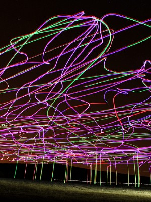
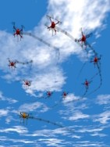

We organized all our drone swarm-related resources around our publication highlights. Please select from the list below to read and see more:

|      | title | authors | journal | year | drones |
| :--- | :---- | :------ | :------ | :--- | :----- |
|  | [Decentralized traffic management of autonomous drones](swarmint2024.md) | Balázs Boldizsár, Tamás Vicsek, Gergő Somorjai, Tamás Nepusz, Gábor Vásárhelyi | _Swarm Intelligence_ | 2024 | 100 |
|  | [Adaptive leadership overcomes persistence—responsivity trade-off in flocking](interface2020.md) | Boldizsár Balázs, Gábor Vásárhelyi, Tamás Vicsek | _J. R. Soc. Interface_ | 2020 | 50 |
|  | [Optimized flocking of autonomous drones in confined environments](scirob2018.md) | Gábor Vásárhelyi, Csaba Virágh, Gergő Somorjai, Tamás Nepusz, A. E. Gusz Eiben, Tamás Vicsek | _Science Robotics_ | 2018 | 30 |
|  | [Coordinated dense aerial traffic with self-driving drones](icra2018.md) | Balázs Boldizsár, Gábor Vásárhelyi | _ICRA_ | 2018 | 30 |
|  | [Outdoor flocking and formation flight with autonomous aerial robots](iros2014.md) | Gábor Vásárhelyi, Csaba Virágh, Gergő Somorjai, Norbert Tarcai, Tamás Szörényi, Tamás Nepusz, Tamás Vicsek | _IROS_ | 2014 | 10 |

## Full list of drone swarm-related publications

* Balázs, B., Vicsek, T., Somorjai, G., Nepusz, T., & Vásárhelyi, G. (2024). Decentralized traffic management of autonomous drones., _Swarm Intelligence_, doi:10.1007/s11721-024-00241-y
[[pdf]](https://link.springer.com/content/pdf/10.1007/s11721-024-00241-y.pdf)

* de Croon, G. C. H. E., Hönig, W., Theraulaz, G., & Vásárhelyi, G. (2023). Cross-disciplinary approaches for designing intelligent swarms of drones. _Swarm Intelligence_, 17(1-2), 1-4.
[[pdf]](https://link.springer.com/content/pdf/10.1007/s11721-023-00223-6.pdf)

* Vásárhelyi, G., Virágh, C., Balázs, B., Somorjai, G., Nepusz, T., & Vicsek, T. (2023). Intelligens drónrajok csoportos viselkedése. _Fizikai Szemle_, 83 (9. (826.)), 315-318.
[[pdf]](https://hal.elte.hu/~vasarhelyi/doc/vasarhelyi2023intelligens.pdf)

* Balázs, B., Vásárhelyi, G., & Vicsek, T. (2020, June). Adaptive leadership overcomes persistence—responsivity trade-off in flocking. _Journal of The Royal Society Interface, 17_(167), 0190853.
doi:10.1098/rsif.2019.0853
[[pdf]](https://hal.elte.hu/~vasarhelyi/doc/balazs2020adaptive.pdf)

* Vásárhelyi, G., Virágh, C., Somorjai, G., Nepusz, T., Eiben, A. E., & Vicsek, T. (2018). Optimized flocking of autonomous drones in confined environments. _Science Robotics, 3_(20), eaat3536.
doi:10.1126/scirobotics.aat3536
[[pdf]](https://hal.elte.hu/~vasarhelyi/doc/vasarhelyi2018optimized.pdf)

* Balázs, B., & Vásárhelyi, G. (2018, May). Coordinated dense aerial traffic with self-driving drones. In _2018 IEEE International Conference on Robotics and Automation (ICRA)_ (pp. 6365-6372).
doi:10.1109/ICRA.2018.8461073
[[pdf]](https://hal.elte.hu/~vasarhelyi/doc/balazs2018coordinated.pdf)

* Janosov, M., Virágh, C., Vásárhelyi, G., & Vicsek, T. (2017). Group chasing tactics: how to catch a faster prey. _New Journal of Physics, 19_(5), 053003.
doi:10.1088/1367-2630/aa69e7
[[pdf]](http://hal.elte.hu/~vasarhelyi/doc/janosov2017group.pdf)

* Virágh, C., Nagy, M., Gershenson, C., & Vásárhelyi, G. (2016, October). Self-organized UAV traffic in realistic environments. In _2016 IEEE/RSJ International Conference on Intelligent Robots and Systems (IROS)_ (pp. 1645-1652).
doi:10.1109/IROS.2016.7759265
[[pdf]](https://hal.elte.hu/~vasarhelyi/doc/viragh2016self.pdf)

* Virágh, C., Vásárhelyi, G., & Vicsek, T. Csoportos mozgás drónokkal _Természet Világa, 145_(6) (pp. 242-245).
[[pdf]](https://hal.elte.hu/~vasarhelyi/doc/viragh2014csoportos.pdf)

* Vásárhelyi, G., Virágh, C., Somorjai, G., Tarcai, N., Szörényi, T., Nepusz, T., & Vicsek, T. (2014, September). Outdoor flocking and formation flight with autonomous aerial robots. In _2014 IEEE/RSJ International Conference on Intelligent Robots and Systems (IROS)_ (pp. 3866-3873).
doi:10.1109/IROS.2014.6943105
[[pdf]](https://hal.elte.hu/~vasarhelyi/doc/vasarhelyi2014outdoor.pdf)

* Virágh, C., Vásárhelyi, G., Tarcai, N., Szörényi, T., Somorjai, G., Nepusz, T., & Vicsek, T. (2014). Flocking algorithm for autonomous flying robots. _Bioinspiration & biomimetics, 9_(2), 025012.
doi:10.1088/1748-3182/9/2/025012
[[pdf]](https://hal.elte.hu/~vasarhelyi/doc/viragh2014flocking.pdf)

* Vicsek, T., & Zafeiris, A. (2012). Collective motion. _Physics reports, 517_(3-4) (pp. 71-140).
doi:10.1016/j.physrep.2012.03.004
[[pdf]](https://arxiv.org/pdf/1010.5017)

## Official institute webpages

* [ELTE Department of Biological Physics](https://physics.elte.hu/en/BIO_research)
* [MTA-ELTE Statistical and Biological Physics Research Group](http://hal.elte.hu/)