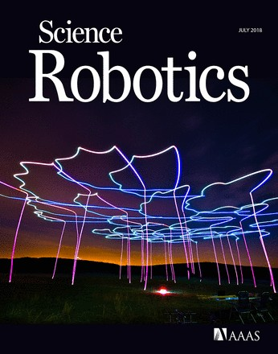

<figure class="float-left">

</figure>

This site is dedicated to the research article

G. Vásárhelyi, Cs. Virágh, G. Somorjai, T. Nepusz, A. E. Eiben, T. Vicsek, **Optimized flocking of autonomous drones in confined environments**, _Science Robotics_, Vol. 3, Issue 20, [eaat3536](http://robotics.sciencemag.org/content/3/20/eaat3536) (2018)

---

## Video Abstract

<iframe src="https://www.youtube.com/embed/E4XpyG4eMKE" frameborder="0" allow="autoplay; encrypted-media" allowfullscreen class="video"></iframe>

## Q & A 

* **What problem is solved here?**
A flocking algorithm has been applied to large swarms of drones optimally to perform synchronized collective motion at high speeds without collision, while also avoiding obstacles.

* **Why is that problem interesting / relevant / challenging?**
This is a basic building block of self-organized drone swarm coordination using collective intelligence. Future drones must be autonomous for many applications - we provide a working solution for outdoor drone swarm control in cluttered and noisy environments.

* **What is new here? What solutions were known before this study?**
Our previous results showed maximum 10 drones at slower speed, with less stability.
Results for dozens of autonomous drones have only been presented indoors, relying on expensive and immobile local positioning systems and central computation and control.
Our solution is noise tolerant, works with low resolution outdoor positioning systems (e.g. GPS) anywhere in the world. Our drone swarm control is scalable in group size and speed due to the combination of realistic modeling and evolutionary optimization.

* **What is the essence of the new solution? What is the key insight of this research? What is THE result?**
We derived a general distributed swarm control framework with many parameters. We focus on model instances instead of models, that is, (evolutionary) optimization is part of the solution.
The key concept in the model is the optimal combination of natural flocking algorithms with distributed motion planning.

* **What makes the solution/insight/result so cool that Science Robotics published it?**
We presented 30 drones flying autonomously without central control (no ground station, no pilots).
The solution is scalable in the number of drones and in the speed of flight (1000 drones @ 115 km/h presented in simulation).

* **Are there any practical applications?**
This is the “coordination” level which is the basis for all swarm applications (“cooperation”, “collaboration”).
All applications where a bunch of drones need to do something autonomously together, e.g. distributed environmental monitoring, collective / self-organized search and rescue operations, crowd inspection, fighting forest fires, precision agriculture, dikes inspection (Netherlands) or drone delivery on massive scale in urban environments.

* **Are the autonomous drones dangerous or can they become dangerous?**
Yes, if someone makes them to do so. Just like a knife, which can be used for good and bad. It is a collective responsibility of humanity to use any technological innovation peacefully. Our drones have never been used for military applications, while we actively help wildlife protection, environmental monitoring and precision agriculture.

* **What research fields are involved in this study?**
  * biological physics
  * artificial intelligence
  * collective robotics

* **What next? Finished? Continued? Diverted?**
  * Fundamental science:
    We keep learning from natural systems (e.g. by creating hierarchical / heterogeneous flocks instead of egalitarian ones).
    We aim for real-time optimized / adaptive systems.
    We do application specific research using the collective motion of drones.
  * Commercial applications: 
    We provide multi-drone services through [CollMot Robotics](https://www.collmot.com/).

## Abstract

We address a fundamental issue of collective motion of aerial robots: how to ensure that large flocks of autonomous drones seamlessly navigate in confined spaces. The numerous existing flocking models are rarely tested on actual hardware because they typically neglect some crucial aspects of multirobot systems. Constrained motion and communication capabilities, delays, perturbations, or the presence of barriers should be modeled and treated explicitly because they have large effects on collective behavior during the cooperation of real agents. Handling these issues properly result in additional model complexity and a natural increase in the number of tunable parameters, which calls for appropriate optimization methods to be coupled tightly to model development. In this paper, we propose such a flocking model for real drones incorporating an evolutionary optimization framework with carefully chosen order parameters and fitness functions. We numerically demonstrated that the induced swarm behavior remained stable under realistic conditions for large flock sizes and notably for large velocities. We showed that coherent and realistic collective motion patterns persisted even around perturbing obstacles. Furthermore, we validated our new model on real hardware, carrying out field experiments with a self-organized swarm of 30 drones. This is the largest of such aerial outdoor systems without central control reported to date exhibiting flocking with collective collision and object avoidance. The results confirmed the adequacy of our approach. Successfully controlling dozens of quadcopters will enable substantially more efficient task management in various contexts involving drones.

## Download Full Text

The full article is available online at [Science Robotics](http://robotics.sciencemag.org/content/robotics/3/20/eaat3536.full.pdf).

## Download Supplementary Material

* **Supplementary Text** available at [Science Robotics](http://robotics.sciencemag.org/content/suppl/2018/07/16/3.20.eaat3536.DC1).
* **Movie S1.** Simulation of old flocking model (algorithm A) with 100 agents, available [on YouTube](https://youtu.be/viEfowBXzho).
* **Movie S2.** Simulation of new flocking model (algorithm B) after evolutionary optimization with 100 agents, available [on YouTube](https://youtu.be/t8kr79k3DUQ).
* **Movie S3.** Simulation of flocking for different speeds (4-32 m/s), flock sizes (30-1000 agents) and scenarios, available [on YouTube](https://youtu.be/KPVfi9Pwuq8).
* **Movie S4.** Flight log visualization of 30 drones at 4 m/s in a diagonal flight pattern, available [on YouTube](https://youtu.be/JMMGIQm7Ris).
* **Movie S5.** Flight log visualization of 30 drones at 6 m/s with obstacles, available [on YouTube](https://youtu.be/YW5zDD70x8o).
* **Movie S6.** Flight log visualization of 30 drones at 8 m/s in a circular flight pattern, available [on YouTube](https://youtu.be/GoiunzowSG4).
* **Movie S7.** Summarizing documentary with simulation, flight log visualization and footage on real flights, available [on YouTube](https://youtu.be/E4XpyG4eMKE).

## Download Flight Logs

Flight logs related to the article are accessible [on Dryad](https://doi.org/10.5061/dryad.mq85r61).

## Download Simulation Code

The code basis of the multi-drone simulation that was used in the article is open-source and can be found at [github.com/csviragh/robotsim](https://github.com/csviragh/robotsim).

## Authors and Affiliation

* [Gábor Vásárhelyi](http://hal.elte.hu/~vasarhelyi/)1,2,3
* [Csaba Virágh](https://hal.elte.hu/flocking/wiki/public/en/people/CsabaViragh)2,4
* [Gergő Somorjai](https://collmot.com/)1,2,3
* [Tamás Nepusz](http://hal.elte.hu/~nepusz/)3,5
* [Agoston E. Eiben](https://www.cs.vu.nl/~gusz/)6
* [Tamás Vicsek](http://hal.elte.hu/~vicsek/)1,2

1[MTA-ELTE Statistical and Biological Physics Research Group](http://hal.elte.hu/) 
2[ELTE Department of Biological Physics](https://fizika.elte.hu/en/index.php?page=tanszek&tid=5) 
3[CollMot Robotics](https://collmot.com/) 
4[Morgan Stanley](https://www.morganstanley.com/) 
5[Molde University College](http://www.himolde.no/english/Sider/side.aspx) 
6[Vrije Universiteit Amsterdam](https://www.vu.nl/nl/index.aspx)

## Funding

* USAF Grant No: FA9550-17-1-0037;
* K_16 Research Grant of the Hungarian National Research, Development and Innovation Office (K 119467);
* János Bolyai Research Scholarship of the Hungarian Academy of Sciences (BO/00219/15/6).

## Media Coverage

### English

* How a flock of drones developed collective intelligence [(wired.com, 2018.07.18.)](https://www.wired.com/story/how-a-flock-of-drones-developed-collective-intelligence/)
* Drones are Programmed to Flock Exactly Like Birds in New Breakthrough Study [(inverse.com, 2018.07.18.)](https://www.inverse.com/article/47138-drone-breakthrough-flocks-delivery-quadcopters)
* Autonomous and cooperating: the dawn of the drone swarm [(cosmosmagazine.com, 2018.07.18.)](https://cosmosmagazine.com/technology/autonomous-and-cooperating-the-dawn-of-the-drone-swarm)
* Researchers Create Drones that Flock Together Like Birds in Breakthrough Study [(dronebelow.com, 2018.07.19.)](https://dronebelow.com/2018/07/19/drones-flock-birds-breakthrough-study/)
* A better way to control a swarm of drones [(techxplore.com, 2018.07.19.)](https://m.techxplore.com/news/2018-07-swarm-drones.html)
* Flock of drones (Quartz on [Facebook](https://www.facebook.com/quartznews/videos/2144977452202612/) and [YouTube](https://www.youtube.com/watch?v=3TYqTtmWhx4&t=55s), 2018.07.19.)

### Hungarian

* Beszélgető drónrajok, összehangolt repülés [(elte.hu, 2018.07.19.)](https://www.elte.hu/content/beszelgeto-dronrajok-osszehangolt-repules.t.17006)
* Újfajta drónvezérlést fejlesztettek ki magyar kutatók [(index.hu, 2018.07.19.)](https://index.hu/tech/2018/07/19/madarrajok_ihlettek_az_elte-n_kifejlesztett_dronvezerlest/)
* Önjáró drónrajokat hoztak létre magyar kutatók [(infostart.hu, 2018.07.19.)](https://infostart.hu/tudomany/2018/07/18/onjaro-dronrajokat-hoztak-letre-magyar-kutatok)
* Biológiai motivációjú algoritmusokat és az evolúció elvét használták az új csoportos drónvezérlés megalkotásához az ELTE kutatói [(webradio.hu, 2018.07.19.)](http://webradio.hu/hirek/it-tudomany/biologiai-motivacioju-algoritmusokat-es-az-evolucio-elvet-hasznaltak-az-uj-csoportos-dronvezerles-megalkotasahoz-az-elte-kutatoi)
 * Csoportos drónvezérléshez írtak algoritmusokat az ELTE kutatói [(origo.hu, 2018.07.19.)](http://www.origo.hu/tudomany/20180719-biologiai-motivacioju-algoritmusokat-es-az-evolucio-elvet-hasznaltak-az-uj-csoportos-dronvezerleshez.html)
 * Drónvezérléssel kísérleteztek az ELTE kutatói [(orientpress.hu, 2018.07.19.)](http://www.orientpress.hu/cikk/2018-07-19_dronvezerlessel-kiserleteztek-az-elte-kutatoi)
 * Beszélgető drónrajok, összehangolt repülés [(civilhetes.net, 2018.07.19.)](https://civilhetes.net/beszelgeto-dronrajok-osszehangolt-repules)
 * Beszélgető drónrajok, összehangolt repülés [(euroastra.blog.hu, 2018.07.19.)](https://euroastra.blog.hu/2018/07/19/beszelgeto_dronrajok_osszehangolt_repules)
 * A Science Robotics folyóiratban az ELTE kutatói: Önálló drón-rajokhoz írtak világszínvonalú algoritmusokat [(vilagfigyelo.com, 2018.07.19)](https://vilagfigyelo.com/a-science-robotics-folyoiratban-az-elte-kutatoi-csoportos-dronvezerleshez-irtak-vilagszinvonalu-algoritmusokat/)
 * Magyar kutatók rávették a drónokat az össszehangolt működésre  [(ng.hu, 2018.07.19.)](http://www.ng.hu/Tudomany/2018/07/19/Magyar-kutatok-ravettek-a-dronokat-az-ossszehangolt-mukodesre)
 * Címlapra kerültek az ELTE tudósai, akik kitaláltak egy drónos okosságot [(hvg.hu, 2018.07.19.)](http://hvg.hu/tudomany/20180719_elte_dronok_dronraj_osszehangolt_repulese_science_robotics)
* Biológia és evolúció a drónvezérlés szolgálatában [(csalad.hu, 2018.07.19.)](http://csalad.hu/2018/07/19/biologia-es-evolucio-a-dronvezerles-szolgalataban)
 * Beszélgető drónok – magyar tudós kutatók sikerei [(infovilag.hu, 2018.07.19.)](http://ww2.infovilag.hu/2018/07/19/beszelgeto-dronok-magyar-tudos-kutatok-sikerei)
 * Rajokban közlekedő önvezető drónok az ELTE kutatóitól [(nullahategy.hu, 2018.07.19.)](https://nullahategy.hu/rajokban-kozlekedo-onvezeto-dronokat-fejlesztettek-az-elte-kutatoi/)
 * Úttörő drónvezérlést fejlesztettek ki a magyar kutatók [(24.hu, 2018.07.20.)](https://24.hu/tech/2018/07/20/uttoro-dronvezerlest-fejlesztettek-ki-a-magyar-kutatok/)
 * Világsiker: csoportos drónvezérlést fejlesztettek az ELTE-s kutatók [(eduline.hu, 2018.07.20.)](http://m.eduline.hu/felsooktatas/2018/7/20/uj_dronvezerles_ELTE_kutatok_BMC3MN)
 * Óriási rajt hoztak létre magyar kutatók önvezérlő drónokból [(qubit.hu, 2018.07.20.)](https://qubit.hu/2018/07/20/oriasi-rajt-hoztak-letre-magyar-kutatok-onvezerlo-dronokbol)
 * Világraszóló magyar fejlesztés: autonóm drónrajok lephetik el az eget? [(nlcafe.hu, 2018.07.20.)](https://www.nlcafe.hu/magyarorszagkul/20180720/vilagraszolo-magyar-fejlesztes-autonom-dronrajok-lephetik-el-az-eget/)

### Dutch

* Doorbraak: drones kunnen voor het eerst geheel zelfstandig in formatie vliegen [(volkskrant.nl, 2018.07.18.)](https://www.volkskrant.nl/wetenschap/doorbraak-drones-kunnen-voor-het-eerst-geheel-zelfstandig-in-formatie-vliegen~b092c1d1/)
* Amsterdamse onderzoeker vestigt wereldrecord met zwerm drones [(parool.nl, 2018.07.19.)](https://www.parool.nl/amsterdam/amsterdamse-onderzoeker-vestigt-wereldrecord-met-zwerm-drones~a4601695/)
* Wereldrecord zelf vliegende drones in één zwerm [(vu.nl, 2018.07.19.)](https://www.vu.nl/nl/nieuws-agenda/nieuws/2018/jul-sep/wereldrecord-zelfvliegende-drones-in-een-zwerm.aspx)
* Wereldrecord zelf vliegende drones in één zwerm [(vrijetijdamsterdam.nl, 2018.07.19.)](https://vrijetijdamsterdam.nl/algemeen/studenten/wereldrecord-zelf-vliegende-drones-in-een-zwerm/)
* Wereldrecord zelfvliegende drones in één zwerm [(blikopnieuws.nl, 2018.07.19.)](http://www.blikopnieuws.nl/wetenschap/265691/wereldrecord-zelfvliegende-drones-in-een-zwerm.html)
* Zwerm drones vliegt autonoom [(deingenieur.nl, 2018.07.20)](https://www.deingenieur.nl/artikel/zwerm-drones-vliegt-autonoom)

### Spanish

* Bandadas [(elpais.com, 2018.07.19.)](https://elpais.com/elpais/2018/07/18/opinion/1531922303_876342.html)
