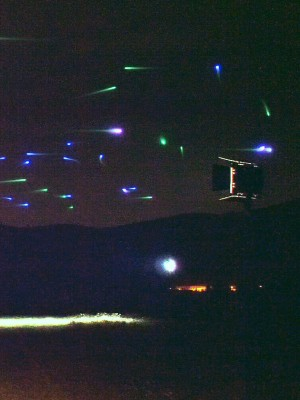

# Decentralized traffic management of autonomous drones

<figure class="float-left">

</figure>

Balázs, B., Vicsek, T., Somorjai, G., Nepusz, T., & Vásárhelyi, G. (2024). **Decentralized traffic management of autonomous drones.**, _Swarm Intelligence_, [doi:10.1007/s11721-024-00241-y](https://doi.org/10.1007/s11721-024-00241-y).

---

## Background

Flocking and traffic are the two basic orthogonal building blocks of swarm motion. In flocking, agents have the same goal and synchronize their motion to go together. In traffic, agents have individual goals and coordinate their motion to avoid conflicts smoothly. This article focuses on the latter case. We developed a traffic algorithm and flew the largest ever autonomous swarm of 100 drones with it. (Note that limits are purely financial, not technical as we demonstrate also in the article with 2500 drones in simulation).

To achieve these goals, we use the same mindset and concept as with our previous flocking algorithms, and combine momentary flocking terms – optimized for traffic – with self-organized path planning. The results substantially outperforms what could ever be done with human pilots.

## Video abstract

There are five Supplementary Movies associated with this article (see below). This is the summarizing documentary with simulation, flight log visualization, and footage on real flights with hundred autonomous drones in dense self-organized traffic:

<iframe src="https://www.youtube.com/embed/87y3AsUOCaQ" frameborder="0" allow="autoplay; encrypted-media" allowfullscreen class="video"></iframe>

## Abstract

Coordination of local and global aerial traffic has become a legal and technological bottleneck as the number of unmanned vehicles in the common airspace continues to grow. To meet this challenge, automation and decentralization of control is an unavoidable requirement. In this paper, we present a solution that enables self-organization of cooperating autonomous agents into an effective traffic flow state in which the common aerial coordination task - filled with conflicts - is resolved. Using realistic simulations, we show that our algorithm is safe, efficient, and scalable regarding the number of drones and their speed range, while it can also handle heterogeneous agents and even pairwise priorities between them. The algorithm works in any sparse or dense traffic scenario in two dimensions and can be made increasingly efficient by a layered flight space structure in three dimensions. To support the feasibility of our solution, we show stable traffic simulations with up to 5000 agents, and experimentally demonstrate coordinated aerial traffic of 100 autonomous drones within a 250 m wide circular area.

## Download Full Text

The full article is available online at [Swarm Intelligence](https://link.springer.com/article/10.1007/s11721-024-00241-y).

## Download Supplmenetary Material

All supplementary materials (texts, tables, figures, videos) are available online at [Swarm Intelligence](https://link.springer.com/article/10.1007/s11721-024-00241-y).

Supplementary videos are also available on YouTube:

* [Supplementary Movie S1: Realistic simulation of 2D decentralized drone traffic with 5, 50, 500 and 5000 agents](https://youtu.be/wIsKGkHs2Po)
* [Supplementary Movie S2: Realistic simulation of 2D decentralized drone traffic with heterogeneous travel speed (2-32 m/s)](https://youtu.be/0Ms_wkeKxzU)
* [Supplementary Movie S3: Realistic simulation of 3D decentralized drone traffic with 500 drones in 1, 2, 3 and 4 layers](https://youtu.be/CgcgccwPm4M)
* [Supplementary Movie S4: Summarizing documentary (video abstract) with simulation, flight log visualization, and footage on real flights](https://youtu.be/VOtu6Vmkp88)
* [Supplementary Movie S5: A three-minute recording of the field experiment with 100 real drones. Credit to: Barnabás Takács](https://youtu.be/v0OJxjIp-HU)

## Funding

* MTA-ELTE Statistical and Biological Physics Research Group
* K\_16 Research Grant, National Research, Development and Innovation Office – NKFIH (K 119467)
* USAF Grant No: FA9550-17-1-0037
* National Research, Development and Innovation Office – NKFIH: OTKA SNN Grant No:139598
* KTNL Research Grant, National Research, Development and Innovation Office - NKFIH (2022-2.1.1-NL-2022-00012)

Special thanks to [CollMot Robotics](https://collmot.com) for using their intelligent drone swarm and their swarm-level ground control station, [Skybrush](https://skybrush.io).

## Media Coverage

Be the first to write about this article!
